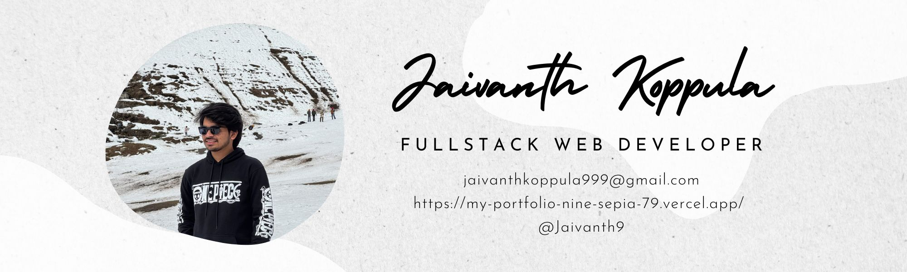

<!-- Banner -->

  

<h1 align="center">Hi 👋, I'm Jaivanth Koppula</h1>

  <strong>A passionate Full-Stack Developer specializing in the MERN stack</strong> 
  I love building robust, scalable, and beautiful web applications.

---

## 🔧 Tech Stack & Tools

  
  
  
  
  
  
  
  
  
  

---

## 🚀 Currently

- 🔨 Working on full-stack MERN projects
- 📚 Learning advanced React patterns and scalable backend systems
- 🤝 Open to collaboration on impactful open-source or freelance projects

---

## 💡 Ask Me About

- Web Development (Frontend + Backend)
- MERN Stack Projects
- REST APIs and MongoDB Design
- Problem Solving and Optimization

---

## 📫 Reach Me

---

## 🧠 Learning & Growth

- 🔍 **Currently Learning**: Next.js, TypeScript, Docker, Tailwind CSS
- 🎯 **Goals 2025**:
  - Contribute to 10+ open-source projects
  - Build 3+ SaaS-like full-stack projects
  - Crack a top-tier software engineering internship

---

## 📈 GitHub Stats

  
  

---

## 🔥 GitHub Streak

  

---

## 📊 Contribution Graph

  

---

## 🏆 GitHub Trophies

  

---

## 📂 Featured Projects

| Project | Description | Tech |
|--------|-------------|------|
| **[NeighborFit](https://github.com/Jaivanth9/NeighborFit)** | A full-stack web app recommending neighborhoods using user preferences and data analysis | MERN, Node.js, Express, React |
| **[RecipeHub](https://github.com/Jaivanth9/RecipeHub)** | Collaborative recipe builder with real-time collaboration and cooking timers | React, Firebase, Tailwind |
| **[RBAC Blog Platform](https://github.com/Jaivanth9/RBAC-Blog)** | Role-based blog system with Admin/User access control | React, MongoDB, Express, Node.js |

---

## ⚡ Fun Fact

> I love turning ☕ coffee into code, and bugs into features 😄

---

> *Built with ❤️ by Jaivanth Koppula*

